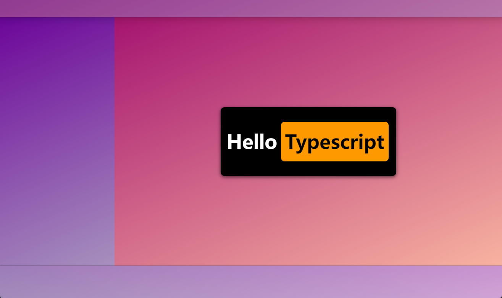

# 一些个人的普通的 typescript 练习(仅此而已)

## References

- 包括但不局限于如下:
  - [MDN](https://developer.mozilla.org/)
  - [小满 zs CSND 个人博客](https://blog.csdn.net/qq1195566313/category_11559497.html?spm=1001.2014.3001.5482)
  - [typescript 中文网](https://www.tslang.cn/)

## Note

- 练习的项目使用 rollup 进行搭建, 可自行修改 `rollup.config.js` 进行配置
- 个人代码练习, 糟糕勿喷 🤣...

## Quick start

```sh
# shell: bash
cd pack-ts && npm install

# open dev server
npm run dev
```

## Demo

- console 测试输出
  
- ~~装饰性的 html 页面~~
  
